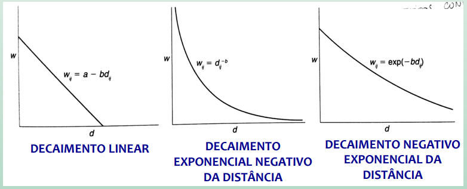
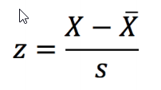
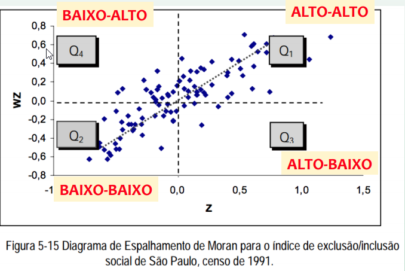

```{r setup, include=FALSE}
options(htmltools.dir.version = FALSE)
```

class: center, middle

## SPOILER!

# [RStudio 1.4 Preview - Citations!](https://blog.rstudio.com/2020/11/09/rstudio-1-4-preview-citations/)

---
class: center, middle

# A natureza dos dados espaciais

### As questões de escala geográfica, agregação e nível de detalhamento são fundamentais para construir representações apropriadas do mundo.

### Diferentes medidas obtidas do mundo real covariam, e compreender a natureza espacial da covariação pode nos ajudar a entender melhor os fenômenos. 


---
class: center, middle, inverse

# A natureza dos dados espaciais

#### Na representação do mundo real, é importante incorporar informações sobre como dois ou mais fatores COVARIAM espacialmente. 

#### Análise dos impactos de investimentos no sistema público de transporte: Avaliação de como os preços dos imóveis aumentam à medida que aumenta a proximidade das estações.

#### Os efeitos de proximidade são fundamentais para representar e compreender a variação espacial e para reunir representações incompletas de lugares únicos.

## Não dá para analisar proximidade numa planilha!!!

---
class: center, middle

# Primeira Lei da Geografia

### “No mundo, todas as coisas se parecem, mas coisas mais próximas são mais parecidas que aquelas mais distantes” <sup>1</sup>

.footnote[
[1] Tobler, W. R. 1970. A computer movie simulating urban growth in the Detroit region. Economic Geography 46: 234–40.
]

---
# Autocorrelação espacial

### A relação entre eventos próximos no espaço pode ser formalizada no conceito de AUTOCORRELAÇÃO ESPACIAL

### A relação entre eventos consecutivos no tempo pode ser formalizada no conceito de AUTOCORRELAÇÃO TEMPORAL

.center[
“No mundo, todas as coisas se parecem, mas coisas mais próximas são mais parecidas que aquelas mais distantes”
#### DEFINIÇÃO SUCINTA DE AUTOCORRELAÇÃO ESPACIAL (positiva)
]

---
# Heterogeneidade Espacial

- Refere-se à variação no relacionamento entre as variáveis no espaço
- Tendência de lugares de serem diferentes uns dos outros.
- Heterogeneidade maior com o aumento da distância
- Alguns fenômenos geográficos variam de maneira gradual através do espaço (estacionariedade), enquanto outros podem
apresentar extrema irregularidade, violando a Lei de Tobler
- Diz respeito a aspectos da estrutura socioeconômica no espaço

---
# Autocorrelação Espacial
.center[
### As medidas de autocorrelação espacial procuram lidar simultaneamente com similaridades na localização dos objetos espaciais e de seus atributos
]

- Autocorrelação Positiva (Lei de Tobler): Feições similares em localização também são similares em atributos
- Autocorrelação Negativa (oposição à Lei de Tobler): Feições similares em localização tendem a ter atributos menos similares do que feições mais distantes
- Ausência de Autocorrelação: Quando atributos são independentes da localização

---
class: center, inverse

# Autocorrelação Espacial

```{r echo=FALSE, message=FALSE, warning=FALSE, out.width="60%"}
knitr::include_graphics("./img/1.png")
```


A interrelação das várias propriedades de um local é um aspecto importante da natureza dos dados geográficas e é fundamental para o entendimento sobre o mundo real.

NO ENTANTO, ELA TAMBÉM É UMA PROPRIEDADE QUE DESAFIA A ANÁLISE DA ESTATÍSTICA CONVENCIONAL, POIS A MAIORIA DOS MÉTODOS ASSUME INDEPENDÊNCIA DAS OBSERVAÇÕES (CORRELAÇÃO ESPACIAL = ZERO)

---
# Matriz de vizinhança

- Para comparar a similaridade de atributos geográficos em feições vizinhas é importante estabelecer um CRITÉRIO DE VIZINHANÇA.

- Baseado neste critério, precisamos definir uma matriz de pesos W na qual cada elemento wij mede a proximidade/vizinhança entre i e j (i identificando a linha; j identificando a coluna da matriz)

- Um critério de vizinhança comumente adotado: CONTIGUIDADE
.center[
wij = 1, se as regiões i e j são contíguas (ou seja, são vizinhas).

wij = 0, caso contrário. 
]
---

# Matriz de vizinhança

### Matriz de pesos
.pull-left[
```{r echo=FALSE, message=FALSE, warning=FALSE, out.width="100%"}
knitr::include_graphics("./img/2.png")
```
]

.pull-right[
```{r echo=FALSE, message=FALSE, warning=FALSE, out.width="100%"}
knitr::include_graphics("./img/3.png")
```
]


---
# Critérios de vizinhança

.pull-left[
Contiguidade: Rook (torre) e Queen (rainha)
```{r echo=FALSE, message=FALSE, warning=FALSE, out.width="100%"}
knitr::include_graphics("./img/4.png")
```
]

.pull-right[
Ordem de contiguidade
```{r echo=FALSE, message=FALSE, warning=FALSE, out.width="100%"}
knitr::include_graphics("./img/5.png")
```
]

---
# Critérios de vizinhança
DISTÂNCIA:
- “n” vizinhos mais próximos;
- distância máxima;
- funções de distância (wij com valores contínuos)

```{r echo=FALSE, message=FALSE, warning=FALSE, out.width="100%"}

```

---

class: center, middle, inverse

# Matriz de vizinhança

O critério adotado para construir uma matriz de vizinhança revela a estrutura espacial considerada na análise, e pode alterar os resultados das medidas de autocorrelação espacial.

Portanto, vale a pena testar alguns critérios alternativos para a definição de “vizinhança” (contiguidade, distância…) e, consequentemente, para a definição da matriz de vizinhança - também conhecida como matriz de pesos ou matriz de proximidade espacial.

---
# Índices de autocorrelação espacial

```{r echo=FALSE, message=FALSE, warning=FALSE, out.width="100%"}
knitr::include_graphics("./img/8.png")
```


---
# Índices de autocorrelação espacial

### Índices Globais de Associação Espacial
- Apresenta uma medida única para toda a área analisada.
- Índice de Moran (I)

.center[
## Métrica usada para testar a hipótese sobre autocorrelação espacial
]

---
# Índice global de Moran
É um índice global de autocorrelação espacial, que varia entre -1 e 1

I = 1   
Extrema Autocorrelação Positiva (Lei de Tobler): Feições similares em localização também são similares
em atributos

I = -1    
Extrema Autocorrelação Negativa (oposição à Lei de Tobler): Feições similares em localização tendem a ter atributos menos similares do que feições mais distantes 

I = 0     
Ausência de Autocorrelação: Quando atributos são independentes da localização

---
# Índice Global de Moran

```{r echo=FALSE, message=FALSE, warning=FALSE, out.width="80%"}
knitr::include_graphics("./img/9.png")
```

wij é o peso, wij=1 se observações i e j são vizinhas.   

yi and ybarra representam o valor da variável na localização i e a média da variável, respectivamente.  

n é o número total de observações

---
# Índice Global de Moran

Estruturado de maneira semelhante ao coeficiente de correlação de Pearson: uma medida padronizada de covariância

```{r echo=FALSE, message=FALSE, warning=FALSE, out.width="80%"}
knitr::include_graphics("./img/10.png")
```

---
# Índice Global de Moran

De forma geral, o Índice de Moran presta-se a um teste cuja hipótese nula é de independência espacial. Neste caso, seu valor seria ZERO.

Valores positivos (entre 0 e +1) indicam autocorrelação positiva Valores negativos (entre 0 e -1) indicam autocorrelação negativa.

No exemplo da variável “consumo de água”, obtemos um I = 0,59 (vizinhança por contiguidade – queen). Será que este valor representa uma correlação espacial significativa estatisticamente????

---
# Teste de Pseudo Significância

Para estimar a significância do índice, seria preciso associar a este uma distribuição estatística, sendo mais usual relacionar a estatística teste à distribuição normal. 

Porém, para evitar pressupostos em relação à distribuição, a abordagem mais comum é um TESTE DE PSEUDO-SIGNIFICÂNCIA.

No TESTE DE PSEUDO-SIGNIFICÂNCIA são geradas diferentes permutações dos valores de atributos associados às regiões.
Cada permutação produz um novo arranjo espacial, onde os valores estão redistribuídos entre as áreas.
Como apenas um dos arranjos corresponde à situação observada, pode-se construir uma distribuição empírica de I. 

No nosso exemplo, seria como se fizéssemos inúmeras permutações com os valores de consumo de água, atribuindo-os aleatoriamente para os diversos municípios e calculando o Índice de Moran para cada uma destas permutações aleatórias.
Faríamos isso, por exemplo 999 vezes! E obteríamos, portanto, 999 valores para o Índice de Moran + o valor do índice de Moran construído sobre os dados observados. Com estes 1000 valores de I, poderíamos contruir uma distribuição do índice. 

---
# Teste de Pseudo Significância

Se o valor do índice I medido originalmente corresponder a um “extremo” da distribuição simulada, então trata-se de valor com significância estatística. 

```{r echo=FALSE, message=FALSE, warning=FALSE, out.width="80%"}
knitr::include_graphics("./img/11.png")
```

.center[
### Ho: não há autocorrelação espacial 
]
---
# Diagrama de espelhamento de Moran

- Maneira adicional de visualizar a dependência espacial
- Construído com base nos valores padronizados (escore-z)
- A ideia é comparar os valores padronizados do atributo numa área com a média dos seus vizinhos, construindo um gráfico bidimensional de z (valores padronizados) por wz (média dos vizinhos).

## Z-Score / escores-z

```{r echo=FALSE, message=FALSE, warning=FALSE, out.width="20%"}

```

---
# Diagrama de espelhamento de Moran

```{r echo=FALSE, message=FALSE, warning=FALSE, out.width="80%"}
knitr::include_graphics("./img/13.png")
```
---
# Diagrama de espelhamento de Moran
- Q1 (valores positivos, médias positivas) e Q2 (valores negativos, médias negativas): indicam pontos de associação espacial positiva, no sentido que uma localização possui vizinhos com valores semelhantes.

- Q3 (valores positivos, médias negativas) e Q4 (valores negativos, médias positivas): indicam pontos de associação espacial negativa, no sentido que uma localização possui vizinhos com valores distintos.

```{r echo=FALSE, message=FALSE, warning=FALSE, out.width="80%"}

```


---
# Diagrama de espelhamento de Moran

Os pontos em Q3 e Q4 podem ser vistos como extremos:

- afastados da reta de regressão linear

- regiões que não seguem o mesmo processo de dependência espacial das demais observações.

.center[
Marcam regiões de transição entre regimes espaciais distintos.
]

---
# Diagrama de espelhamento de Moran

O Diagrama também pode ser apresentado na forma de mapa temático, no qual cada polígono é apresentado indicando-se seu
quadrante no diagrama de espalhamento 

```{r echo=FALSE, message=FALSE, warning=FALSE, out.width="80%"}
knitr::include_graphics("./img/14.png")
```


---
# Moran Scatterplot
- the Moran scatter plot is invoked from the Explore menu or by clicking on the matching toolbar button
- you must always specify the file name for a weights file; you may have to create that file first
- the Moran scatter plot behaves like a regular scatter plot and can use the `Exclude Selected` option; this is particularly useful to assess the influence of boundary locations
- use the randomization option with several runs to assess the sensitivity of the pseudo significance level
- link the four quadrants in the scatter plot to the map to distinguish different types of spatial autocorrelation
- add envelope slopes to visualize the likely range of Moran’s I under spatial randomness
- use the special Moran scatter plot for rates to assess the effect of variance instability on your inference
- repeat the analysis for different spatial weights to assess the sensitivity of your inference to the weights choice


---
# LISA Maps

you invoke the LISA map functionality from the Explore menu or by clicking the matching toolbar button

- as for the Moran scatter plot, you must always specify a spatial weights file
- use both the Significance Map and the Cluster Map options to identify spatial clusters and spatial outliers
- link the locations classified as clusters or outliers back to maps with different variables, and/or other graphs to look for potential associations
- assess the sensitivity of the cluster/outlier locations by varying the number of permutations and the significance cutoff
- add the Local Moran statistic (classification and p-value) to the table and save for future use in other analyses
- repeat the analysis for different spatial weights to assess the sensitivity of your inference to the weights choice
